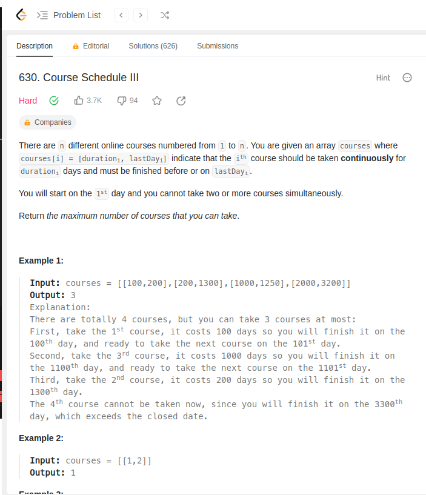
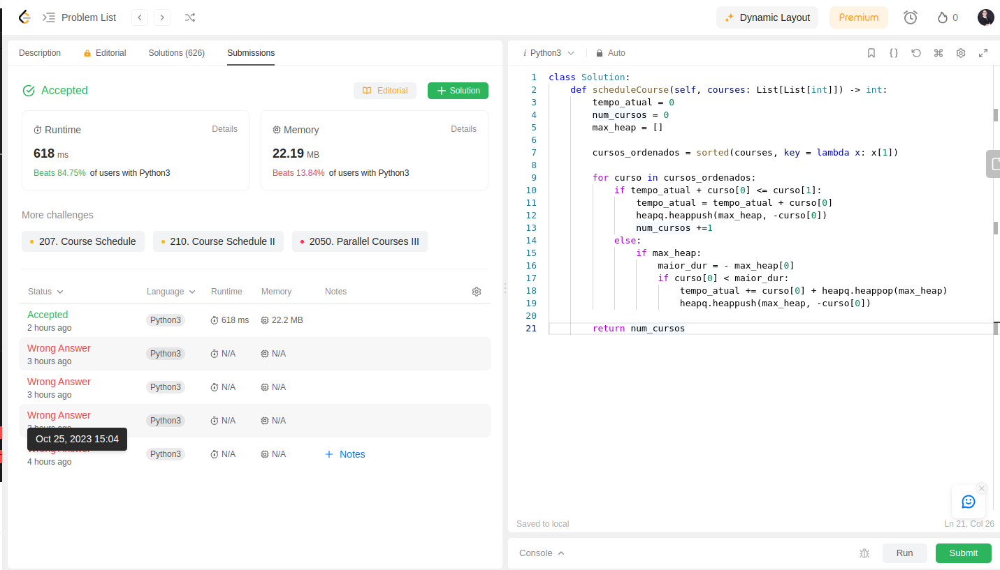
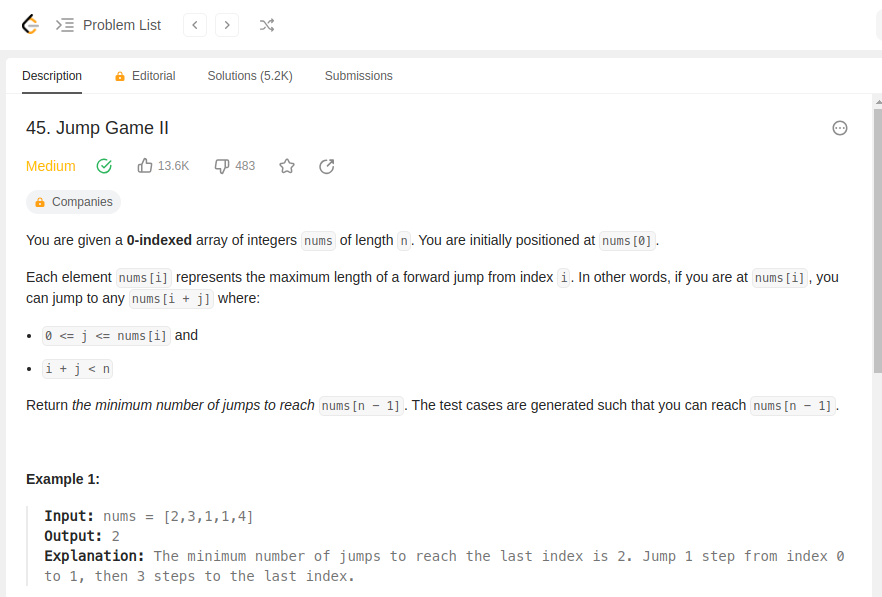
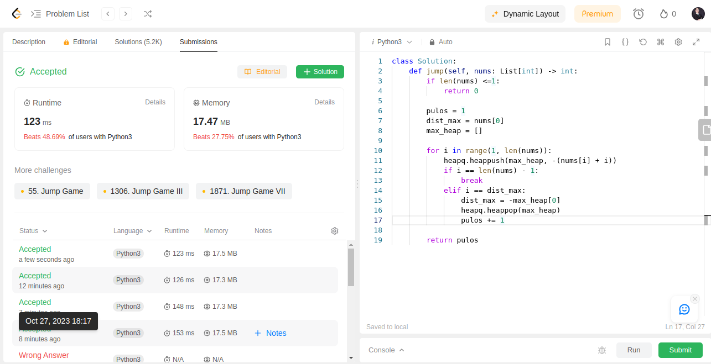
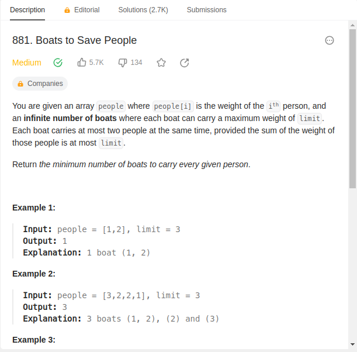
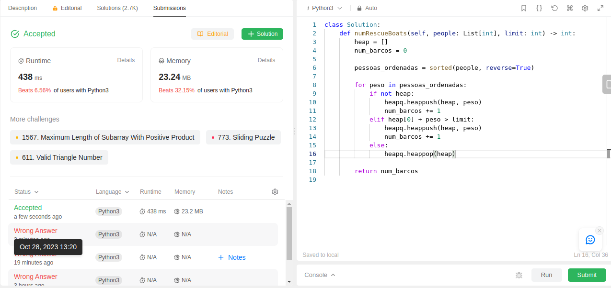
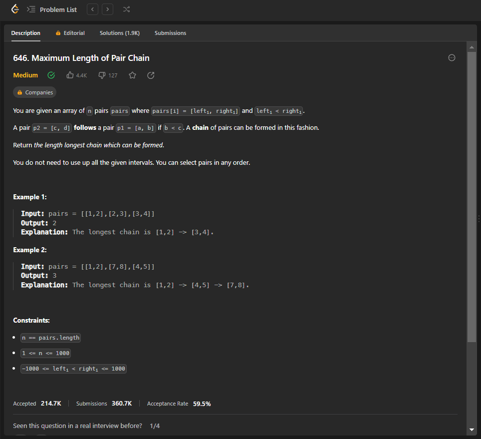
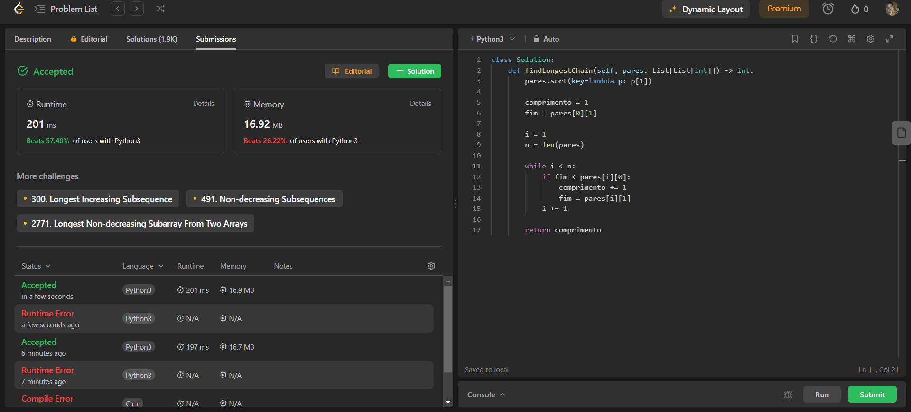
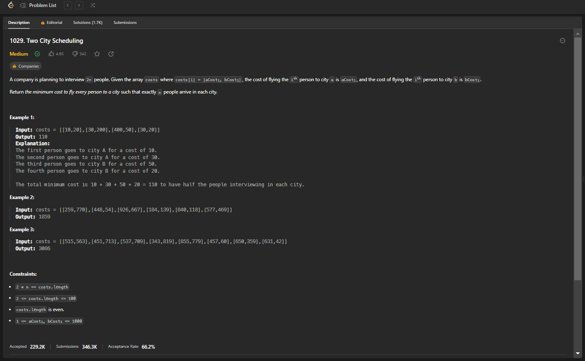
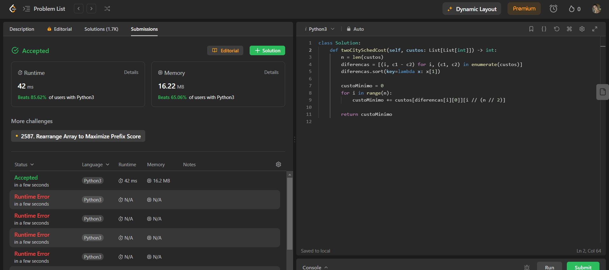

**Conteúdo da Disciplina**: Greed<br>

## Alunos
|Matrícula | Aluno |
| -- | -- |
| 20/0025449  |  Natan Tavares Santana |
| 20/0036351  |  Clara Marcelino Ribeiro de Sousa |

## Sobre 
Resolução de exercicios de Juízes online que envolvam Algoritmos Ambiciosos. Cada pasta dentro deste repositório tera a solução para um dos exercícios.

Exercícios Resolvidos:

|Nome | Dificuldade | Plataforma |
| -- | -- | -- |
| [630. Course Schedule III](https://leetcode.com/problems/course-schedule-iii/description/)  |  Hard | Leetcode |
| [45. Jump Game II](https://leetcode.com/problems/jump-game-ii/description/)  |  Medium | Leetcode |
| [881. Boats to Save People](https://leetcode.com/problems/boats-to-save-people/description/)  |  Medium | Leetcode |
| [646. Maximum Length of Pair Chain](https://leetcode.com/problems/maximum-length-of-pair-chain/description/)  |  Medium | Leetcode |
| [1029. Two City Scheduling](https://leetcode.com/problems/two-city-scheduling/description/)  |  Medium | Leetcode |

## Screenshots

### 630. Course Schedule III
Problema:


Solução:



### 45. Jump Game II

Problema:


Solução:



### 881. Boats to Save People

Problema:


Solução:



### 646. Maximum Length of Pair Chain

Problema:


Solução:



### 1029. Two City Scheduling

Problema:


Solução:


## Instalação 
**Linguagem**: Python<br>

É necessário ter Python3 instalado no computador.

## Uso 
Entre dentro de uma pasta de exercício e rode o comando:

```
python3 main.py
```


